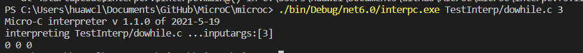
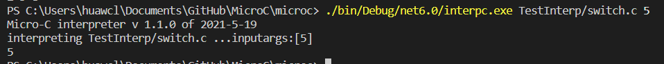

### 编译原理——HZY

- 解释器支持以下类型：

  - 整数

    解释器已经有int类型，此处额外添加将十六进制、二进制转化为十进制输出

    - 定义

    ```
    and expr =    
      | CreateI of string * int
    ```

    - 词法添加

    ```
    let keyword s =   
        match s with
    	| "createI" -> CREATEI
    ```

    - 语法添加

    ```
    %toke CREATEI
    ExprNotAccess:
      | CREATEI LPAR CSTSTRING COMMA CSTINT RPAR {CreateI($3,$5)  }
    ```

    - 解释器实现解析

    ```
    and eval e locEnv gloEnv store : mem  * store = 
    
        match e with
    	| CreateI(s,hex) -> let mutable res = 0;
                            for i=0 to s.Length-1 do
                               if s.Chars(i)>='0' && s.Chars(i)<='9' then
                                 res <- res*hex + ( (int (s.Chars(i)))-(int '0') )
                               elif s.Chars(i)>='a' && s.Chars(i)<='f' then
                                 res <- res*hex + ( (int (s.Chars(i)))-(int 'a')+10 )
                               elif s.Chars(i)>='A' && s.Chars(i)<='F' then
                                 res <- res*hex + ( (int (s.Chars(i)))-(int 'A')+10 )
                               else 
                                 failwith("ERROR WORLD IN NUMBER")
                            (res,store)                     
    ```

    - 测试案例

    ```
     void main() {
        int a;
        a = createI("F122",16);
        print("%d",a);
        int b;
        b = createI("1010",2);
        print("%d",b);
    }
    ```

    

  - 字符

    解释器可以识别字符类型

    - 定义

    ```
    type typ =
        | TypC (* Type char                   *)
    and expr = 
      | CstC of char    
    ```

    - 词法添加

    ```
    let keyword s =
        match s with
        | "char"    -> CHAR 
    rule Token = parse
        | ['\'']['a'-'z''A'-'Z''0'-'9']['\'']
            { try let single = lexemeAsString lexbuf in CSTCHAR (System.Char.Parse(single.Substring(1, 1))) with ex -> failwith "Char literal error." }
    ```

    - 语法添加

    ```
    %token <char> CSTCHAR
    %token CHAR
    AtExprNotAccess:
        | CstC                          { CstC($1)       }
    Type:
        | CHAR                                { TypC     }
    CstC:
        CSTCHAR             {  $1  }
    ```

    - 解释器实现解析

    ```
    and eval e locEnv gloEnv store : int * store =
        match e with
    	| CstC c -> ((int c), store)
    ```

    

    - 需要格外修改一下println（原定义格式println输出char类型，print输出int类型）

    ```
    | PRINTLN Expr                        { Prim1("printc", $2) }
    ```

  - 布尔类型

    解释器可以识别布尔类型，true为1，false为0

    - 定义

    ```
    type typ =
        | TypB
    and expr =  
    	| CstB of bool
    ```

    - 词法添加

    ```
    let keyword s =
        match s with
    	| "boolean" -> BOOLEAN
    	| "true"    -> CSTBOOL 1
    	| "false"   -> CSTBOOL 0
    ```

    - 语法添加

    ```
    %token <int> CSTINT CSTBOOL 
    %token BOOLEAN
    Const:
        CSTINT                              { $1       }
      | CSTBOOL                             { $1       }
    Type:
      | BOOLEAN                             { TypB     }
    ```

    - 解析器实现解析

    ```
    void main() {
        boolean flag=true;
        if (flag) {
            print(1);
        }
        if (!flag) {
            print(0);
        }
    }
    ```

    - 测试案例

    ```
    void main() {
        boolean flag=true;
        if (flag) {
            print(1);
        }
        if (!flag) {
            print(0);
        }
    }
    ```

    

  - 指针（自带）

    - 测试案例

    ```
    void main (int n){
    int * p;
    p = &n;
    print *p;
    }
    ```

    

  - 数组（自带）

    - 测试案例

    ```
    void main (){
    int ia[2];
    ia[1] = 7;
    print ia[1];
    }
    ```

    

- 解释器支持以下规则：

  - 自动转型（弱类型）、类型检查（自带）

    - 测试案例

    ```
    void main() {
      print("%d",'3');
      print("%c",67);
    }
    ```

    

  - 强制转型

    解释器除了在运算时，使用上述规则进行转换以外，还支持强制的类型转换，其中，int 可以强制转换为char的‘0’-‘9’，反向转换同理

    - 定义
    
    ```
    and expr =  
    	| ToInt of expr
    	| ToChar of expr
    ```

    - 词法添加
    
    ```
    let keyword s =   
        match s with
    	| "Int"     -> TOINT
  	| "Char"    -> TOCHAR
    ```

    - 语法添加
    
    ```
    %toke TOCHAR TOINT
    %right TOCHAR TOINT
    ExprNotAccess:  
      | LPAR TOCHAR RPAR Expr               { ToChar($4)          }
    | LPAR TOINT RPAR Expr                { ToInt($4)           }
    ```

    - 解析器实现解析
    
    ```
    and eval e locEnv gloEnv structEnv store : mem  * store = 
    
        match e with
    	| ToInt e ->  let (res,s) = eval e locEnv gloEnv store
                      match res with
                      | i when i>=(int '0') && i<=(int '9') -> (int i - int '0',s)
                      | _ ->  ((res) ,s)
        | ToChar e -> let (res,s) = eval e locEnv gloEnv store
                      match res with
                      | i when i>=0 && i<=9 -> ((i + int '0'),s)
                    | _ ->  ((res) ,s)
    ```

    - 测试案例
    
    ```
    void main() {
      print("%d",(Int)'3');
      print("%c",(Char)2);
  }
    ```
    
    

- 解释器支持以下变量：

  - 定义

    变量名一定要小写字母开头，解释器在获取变量定义的时候，对变量名进行检查，如果不写小写会报错，不再进行运行

    - 语法添加

    ```
    let isCorrect s:string  = 
        match (string s) with
        | _ -> if((string s).[0]>='A' && (string s).[0]<='Z') then failwith("var can not start with uppercase")
               else (string s)
    // 变量描述
    Vardesc:                         
        // "i"    标识符                        fun t->t  id 函数
        NAME                                { ((fun t -> t), isCorrect($1)  )   }
    ```

    - 测试案例

    ```
    void main(){
        int A = 3;
        print A;
    }
    ```

    

  - 在定义时赋初值

    解释器支持在变量定义时赋初值

    - 定义

    ```
    and stmtordec =                                              
      | DeclareAndAssign of typ * string * expr
    
    and topdec = 
      | VariableDeclareAndAssign of typ * string * expr
    ```

    - 词法添加

    ```
    //无
    ```

    - 语法添加

    ```
    let first  (a, _, _) = a
    let second (_, b, _) = b
    let third  (_, _, c) = c
    
    Topdec: 
      | VariableDeclareAndAssign SEMI       { VariableDeclareAndAssign(first $1, second $1 , third $1)  }
      
    VariableDeclareAndAssign:
        Type  Vardesc ASSIGN Expr    { ((fst $2) $1, snd $2 , $4) }
    
    StmtOrDecSeq:
      | VariableDeclareAndAssign SEMI StmtOrDecSeq { DeclareAndAssign(first $1, second $1 , third $1) :: $3 }
    ```

    - 解析器实现解析

    ```
    and stmtordec stmtordec locEnv gloEnv store = 
        match stmtordec with 
        | DeclareAndAssign(typ, x,e) -> let (loc,store1) = allocate (typ, x)  locEnv store
                                        let (loc2, store2) = access (AccVar x) loc gloEnv store1
                                        let (res, store3) =  eval e loc gloEnv store2
                                        (loc, setSto store3 loc2 res) 
                                        
    let initEnvAndStore (topdecs : topdec list) : locEnv * funEnv * store = 
        //包括全局函数和全局变量
        info (fun () -> printf "topdecs:%A\n" topdecs)
    
        let rec addv decs locEnv funEnv store = 
            match decs with 
            | VariableDeclareAndAssign (typ,x,e) :: decr ->
              let (locEnv1, sto1) = allocate (typ, x) locEnv store
              addv decr locEnv1 funEnv sto1 
    ```

    - 测试案例

    ```
    void main(){
        int a = 3;
        print a;
    }
    ```

    

  - 默认初值

    int的默认初值为0，boolean的默认初值为0，char的初值为-1。因为解释器中store存储的是int类型，所以暂无办法让char类型的默认值为‘ ’

    - 解析器实现解析

    ```
    let rec allocate (typ, x) (env0, nextloc) sto0 : locEnv * store =
    
        let (nextloc1, v, sto1) =
            match typ with
            //数组 调用 initSto 分配 i 个空间
            | TypA (t, Some i) -> (nextloc + i, nextloc, initSto nextloc i sto0)
            | TypI   -> (nextloc,  0,sto0)
            | TypB   -> (nextloc,  0,sto0)
            // 常规变量默认值是 -1
            | _ -> (nextloc, -1, sto0)
    ```

    - 测试案例

    ```
    void main(){
        int a ;
        print a;
        boolean b;
        print b;
        char c;
        print c;
    }
    ```

    

- 解释器支持以下运算：

  - 运算  加减乘除取余数（自带）<br />与或非运算（自带）

    ```
    //加减乘除取余
    void main(){
        int a; a=2;
        int b; b=4;
        int c; c=a+b; print c;
        int d; d=b-a; print d;
        int e; e=a*b; print e;
        int f; f=b/a; print f;
        int g; g=b%a; print g;
    }
    ```

    

    ```
    //与或非
    void main(){
        int a; a=1;
        int b; b=0;
        print a&&b;
        print a||b;
        print !a;
    }
    ```

    

  - 自增

    解释器通过a++来实现加一运算

    - 定义

    ```
    and expr =
        | Increase of access
    ```

    - 词法添加

    ```
    rule Token = parse
        | "++"            { INCREASE }
    ```

    - 语法添加

    ```
    %token INCREASE
    %right INCREASE// 优先级
    ExprNotAccess:
        | INCREASE Access                     { Increase($2)        }
        | Access INCREASE                     { Increase($1)        }
    ```

    - 解释器实现解析

    ```
    and eval e locEnv gloEnv store : int * store =
        match e with
        | Increase (acc) ->
            let (loc, store1) = access acc locEnv gloEnv store
            let (res) = getSto store1 loc
            (res + 1, setSto store1 loc (res + 1))
    ```

    - 测试案例

    ```
    void main(int n){
        n++;
        print n;
    }
    ```

    

  - 自减

    解释器通过a--来实现减一运算

    - 定义

    ```
    and expr =
      | Decrease of access
    ```

    - 词法添加

    ```
    rule Token = parse
      | "--"            { DECREASE}
    ```

    - 语法添加

    ```
    %token DECREASE
    %right DECREASE// 优先级
    ExprNotAccess:
        | DECREASE Access                     { Decrease($2)        }
      | Access DECREASE                     { Decrease($1)        }
    ```

    - 解释器实现解析

    ```
    and eval e locEnv gloEnv store : int * store =
        match e with
        | Decrease (acc) ->
            let (loc, store1) = access acc locEnv gloEnv store
            let (res) = getSto store1 loc
          	(res - 1, setSto store1 loc (res - 1))
    ```

    - 测试案例

    ```
    void main(int n){
        n--;
        print n;
    }
    ```

    

  - 三目运算

    解释器通过a？b：c来实现三目运算，判定a表达式的值来决定执行b或者c

    - 定义

    ```
    and expr =
        | Prim3 of expr * expr * expr (* 三目运算 *)
    ```

    - 词法添加

    ```
    rule Token = parse
        | "?"             { QUE }
        | ':'             { COLON }
    ```

    - 语法添加

    ```
    %token QUE COLON
    %right QUE COLON
    ExprNotAccess:
        | Expr QUE Expr COLON Expr            { Prim3($1,$3,$5)     }
    ```

    - 解析器实现解析

    ```
    and eval e locEnv gloEnv store : int * store =
        match e with
        | Prim3 (e1, e2, e3) ->
            let (i1, store1) = eval e1 locEnv gloEnv store
            let (i2, store2) = eval e2 locEnv gloEnv store1
            let (i3, store3) = eval e3 locEnv gloEnv store2
            if i1 = 0 then
                (i3, store3)
            else
                (i2, store3)
    ```

    - 测试案例

    ```
    void main(int n){
        int i;
        i = n > 3 ? 1 : 0 ;
        print i;
    }
    ```

    

  - +=、-=、*=、/=、%=运算

    解释器支持使用+=、-=、*=、/=和%=运算

    - 定义
    
    ```
    and expr =    
  	| Self of  access * string * expr
    ```

    - 词法添加
    
    ```
    rule Token = parse
      | "+="            { SELFPLUS }
      | "-="            { SELFMINUS }
      | "*="            { SELFTIMES }
      | "/="            { SELFDIV }
      | "%="            { SELFMOD }
    ```

    - 语法添加
    
    ```
    %toke SELFPLUS SELFMINUS SELFTIMES SELFDIV SELFMOD
    %left SELFPLUS SELFMINUS SELFTIMES SELFDIV SELFMOD
    ExprNotAccess:
      | Access SELFPLUS  Expr               { Self($1,"+",$3)     }
      | Access SELFMINUS  Expr              { Self($1,"-",$3)     }
      | Access SELFTIMES  Expr              { Self($1,"*",$3)     }
      | Access SELFDIV  Expr                { Self($1,"/",$3)     }
      | Access SELFMOD  Expr                { Self($1,"%",$3)     }
    ```

    - 解析器实现解析
    
    ```
    and eval e locEnv gloEnv store : mem  * store = 
    
        match e with
        | Self(acc,opt,e)-> let (loc, store1) = access acc locEnv gloEnv store
                            let (mem1) = getSto store1 loc
                            let (mem2, store2) = eval e locEnv gloEnv store
                            let i1 =  mem1
                            let i2 =  mem2
                            match opt with
                            | "*"  ->  let res = i1 * i2
                                       (res, setSto store2 loc res)
                            | "+"  ->  let res = i1 + i2
                                       (mem1, setSto store2 loc res)
                            | "-"  ->  let res = i1 - i2
                                       (mem1, setSto store2 loc res)
                            | "/"  ->  let res = i1 / i2
                                       (res, setSto store2 loc res)
                            | "%"  ->  let res = i1 % i2
                                       (res, setSto store2 loc res)
                            | _    -> failwith ("unknown primitive " + opt)
    ```

    - 测试案例
    
    ```
    void main(int n) {
        int a;
        a=10;a+=n;print a;
        a=10;a-=n;print a;
        a=10;a*=n;print a;
        a=10;a/=n;print a;
        a=10;a%=n;print a;
  }
    ```
    
    

- 解释器支持以下语句：

  - if（自带）

    - 测试案例

    ```
    void main(int n ) {
        if(n==8){
       print 1;
        }
        else
        {
         print 0;
      }
    }
    ```

    

  - while（自带）

    - 测试案例

    ```
    void main(int n ) {
          while(n>0){
         print 1;
           n--;
          }
      }
    ```

    

  -  print （自带）

    - 测试案例

    ```
    void main(int n ) {
           print n;
    }
    ```

    

  - print（格式化）

    解释器的自带的格式为print n，先将其格式化print("%d",n)或print("%c",c)

    - 定义

    ```
    and expr =
    	| Print of string * expr
    ```

    - 词法添加

    ```
    //原基础已有
    ```

    - 语法添加

    ```
    ExprNotAccess:
    	| PRINT LPAR CSTSTRING COMMA Expr RPAR {  Print($3,$5)      }
    ```

    - 解析器实现解析

    ```
    and eval e locEnv gloEnv store : 'a * store =
        match e with
    	| Print (op, e1) ->
            let (i1, store1) = eval e1 locEnv gloEnv store
    
            let res =
                match op with
                | "%c" ->
                    (printf "%c " (char i1)
                     i1)
                | "%d" ->
                    (printf "%d " i1
                     i1)
    
            (res, store1)
    ```

    - 测试案例

    ```
    void main() {
      int i=5;
      print("%d",i);
      char c='a';
      print("%c",c);
    }
    ```

    

  - dowhile

    解释器支持dowhile语句:

    - 定义

    ```
    and stmt =
          | DoWhile of stmt * expr (* DoWhile loop       *)
    ```

    - 词法添加

    ```
    let keyword s =
      	| "while"   -> WHILE 
        | "do"   -> DO
    ```

    - 语法添加

    ```
      %token WHILE DO
      StmtM:  /* No unbalanced if-else */
          | DO StmtM WHILE LPAR Expr RPAR SEMI     { DoWhile($2,$5)}
    ```

    - 解析器实现解析

    ```
      let rec exec stmt (locEnv: locEnv) (gloEnv: gloEnv) (store: store) : store =
          match stmt with
          | DoWhile (body, e) ->
              let rec loop store1 =
                  // 求值 循环条件
                  let (v, store2) = eval e locEnv gloEnv store1
                  // 下一轮循环
                  if v <> 0 then
                      loop (exec body locEnv gloEnv store2)
                  else
                      store2
              loop (exec body locEnv gloEnv store)
    ```

    - 测试案例

    ```
    void main(int n) {
          int i;
          i=0;
         do {
              print i;
              n=n-1;
         }  
         while(i<n);
      }
    ```

    

  - do-until

    解释器支持dountil语句，执行一个函数直到满足某个条件

    - 定义

    ```
    and stmt =
          | DoUntil of stmt * expr (* DoUntil loop       *)
    ```

    - 词法添加

    ```
    let keyword s =
          | "until"   -> UNTIL
          | "do"   -> DO
    ```

    - 语法添加

    ```
      %token DO UNTIL
      StmtM:  /* No unbalanced if-else */
          | DO StmtM UNTIL LPAR Expr RPAR SEMI     { DoUntil($2,$5)}
    ```

    - 解析器实现解析

    ```
      let rec exec stmt (locEnv: locEnv) (gloEnv: gloEnv) (store: store) : store =
          match stmt with
          | DoUntil (body, e) ->
              let rec loop store1 =
                  // 求值 循环条件
                  let (v, store2) = eval e locEnv gloEnv store1
                  // 下一轮循环
                  if v = 0 then
                      loop (exec body locEnv gloEnv store2)
                  else
                      store2
              loop (exec body locEnv gloEnv store)
    ```

    - 测试案例

    ```
      void main(int n) {
          int i;
          i=0;
         do{
              print i;
              i = i+1;
         }  
         until(i>n);
      }
    ```

    

  - for

    解释器支持for循环语句

    - 定义

    ```
      and stmt =
          | For of expr * expr * expr * stmt
    ```

    - 词法添加

    ```
      let keyword s =
          | "for"     -> FOR
    ```

    - 语法添加

    ```
    %token FOR
      StmtM:  /* No unbalanced if-else */
            | FOR LPAR Expr SEMI Expr SEMI Expr RPAR StmtM     { For($3,$5,$7,$9)  }
    ```

    - 解析器实现解析

    ```
    let rec exec stmt (locEnv: locEnv) (gloEnv: gloEnv) (store: store) : store =
      match stmt with
        | For (e1, e2, e3, body) ->
          let (res, store0) = eval e1 locEnv gloEnv store
            let rec loop store1 =
              //求值 循环条件,注意变更环境 store
                let (v, store2) = eval e2 locEnv gloEnv store1
                // 继续循环
                if v <> 0 then
                  let (v2, store3) =
                        eval e3 locEnv gloEnv (exec body locEnv gloEnv store2)
                  loop store3
                else
                  store2
            loop store0
    ```

    - 测试案例

    ```
      void main(int n){
          int i;
          for (i = 0; i < n; i = i + 1){
              print i;
        }
      }
    ```

    

  - forin

    解释器支持forin的语法，类似如下的定义方式，for  i  in  (a,b,c) ,a、b、c为int类型，则i将在以c为间隔依次赋值a-b之间的数据，执行循环体

    - 定义

    ```
      and stmt =
        	| ForIn of access * expr * expr * expr * stmt
    ```

    - 词法添加

    ```
     let keyword s =
          | "for"     -> FOR 
          | "in"      -> IN
          | "range"      -> RANGE
    ```

    - 语法添加

    ```
    %token	FOR IN RANGE
      StmtM:  /* No unbalanced if-else */
          | FOR Access IN RANGE LPAR Expr COMMA Expr COMMA Expr RPAR StmtM {ForIn($2, $6, $8, $10, $12)}
      StmtU:
          | FOR Access IN RANGE LPAR Expr COMMA Expr COMMA Expr RPAR StmtM {ForIn($2, $6, $8, $10, $12)}
    ```

    - 解析器实现解析

    ```
    | ForIn (var, e1, e2, e3, body) ->
            let (local_var, store1) = access var locEnv gloEnv store
            let (start_num, store2) = eval e1 locEnv gloEnv store1
            let (end_num, store3) = eval e2 locEnv gloEnv store2
            let (step, store4) = eval e3 locEnv gloEnv store3
            let rec loop temp store5 =
            let store_local =
                    exec body locEnv gloEnv (setSto store5 local_var temp)
            if temp + step < end_num then
                let nextValue = temp + step
                loop nextValue store_local
            else
                store_local
    
            if start_num < end_num then
                let intValue = start_num
                loop intValue store4
            else
                store4
        
    ```

    - 测试案例

    ```
     void main() {
            int i;
            for i in range (2,10,3)
            {
                print i;
            }
        }
    ```

    

  - switch-case-default

    实现了不同于c语言的switch语句，当一个case语句匹配完成时，退出语句switch执行体，default关键字可以匹配全部的条件

    - 定义

    ```
     and stmt =
            | Switch of expr * stmt list
            | Case of expr * stmt
            | Default of stmt
    ```

    - 词法添加

    ```
      let keyword s =
            | "switch"   -> SWITCH
            | "case"   -> CASE
            | "default"   -> DEFAULT
        rule Token = parse
            | ':'             { COLON }
    ```

    - 语法添加

    ```
    %token SWITCH CASE DEFAULT
      %token COLON
      %right COLON
      StmtM:  /* No unbalanced if-else */
            | SWITCH LPAR Expr RPAR LBRACE StmtCase RBRACE   { Switch($3,$6)}
      StmtCase:
            CASE AtExprNotAccess COLON StmtM        {[Case($2,$4)]}
            | CASE AtExprNotAccess COLON StmtM StmtCase      {Case($2,$4) :: $5}
            | DEFAULT COLON StmtM        {[Default($3)]}
      ;
    ```

    - 解析器实现解析

    ```
    let rec exec stmt (locEnv: locEnv) (gloEnv: gloEnv) (store: store) : store =
        match stmt with
        | Switch (e, body) ->
        let (res, store1) = eval e locEnv gloEnv store
    
        let rec choose list =
            match list with
            | Case (e1, body1) :: tail ->
                let (res2, store2) = eval e1 locEnv gloEnv store1
                if res2 = res then
                    exec body1 locEnv gloEnv store2
                else
                    choose tail
            | [] -> store1
            | Default (body1) :: tail ->
                exec body1 locEnv gloEnv store1
                choose tail
        (choose body)
    
    | Case (e, body) -> exec body locEnv gloEnv store
    ```

    - 测试案例

    ```
      void main(int n){
            switch (n){
                case 0:
                    print 0 ;
                case 1:
                    print 1;
                case 2:
                    print 2 ;
                case 3:
                    print 3;
                case 4:
                    print 4;
                case 5:
                    print 5;
                default:
                    print 99999;
            }
        }
    ```

    

  - 模式匹配

    有点点类似于switchcase

    - 定义
    
    ```
     and stmt =
          | Match of expr * stmt list
          | Pattern of expr * stmt
    ```

    - 词法添加
    
    ```
      let keyword s =
          | "match"   -> MATCH
          | "with"    -> WITH
      rule Token = parse
          | "->"            { DEAL }
          | "|"             { MATCHS }
    ```

    - 语法添加
    
    ```
      %token MATCH WITH
      %token DEAL MATCHS
      StmtM:  /* No unbalanced if-else */
          | MATCH Expr WITH StmtPattern    {Match($2,$4)}
      StmtPattern:
          MATCHS AtExprNotAccess DEAL StmtM           {[Pattern($2,$4)]}
          | MATCHS AtExprNotAccess DEAL StmtM StmtPattern           {Pattern($2,$4) :: $5}
  ;
    ```

    - 解析器实现解析
    
    ```
     let rec exec stmt (locEnv: locEnv) (gloEnv: gloEnv) (store: store) : store =
          match stmt with
          | Match (e, body) ->
              let (res, store1) = eval e locEnv gloEnv store
              let rec choose list =
                  match list with
                  | Pattern (e1, body1) :: tail ->
                      let (res2, store2) = eval e1 locEnv gloEnv store1
                      if res2 = res then
                          exec body1 locEnv gloEnv store2
                      else
                          choose tail
                  | [] -> store1
              (choose body)
      
  	| Pattern (e, body) -> exec body locEnv gloEnv store
    ```

    - 测试案例
    
    ```
      void main(int n){
          match n with
          | 10 -> print n+1;
          | 5 -> print n+2 ;
  }
    ```
    
    

- 解释器支持以下函数：

  支持返回函数
  

函数支持return返回

  - 解析器实现解析

  ```
  let rec exec stmt (locEnv: locEnv) (gloEnv: gloEnv) (store: store) : store =
      match stmt with
  	  | Return e ->  match e with
                    | Some e1 -> let (res ,store0) = eval e1 locEnv gloEnv store;
                                 let st = store0.Add(-1, res);
                                 (st)                     
                    | None -> store
  
  and callfun f es locEnv gloEnv store : int * store =
  	let store3 = exec fBody fBodyEnv gloEnv store2
      // (-111, store3)
      let res = store3.TryFind(-1) 
      let restore = store3.Remove(-1)
      match res with
    // | None -> ( BOOLEAN false,restore)
       | Some i -> (i,restore)
  ```

    - 测试案例

  ```
    int fact(int i){
        if(i == 1){
            return 1;
        }else{
            return i * fact(i - 1);
        }
    }
    void main(){
        int n;
        n=4;
        print n;
      print fact(n);
    }
  ```

  


心得体会：

- 大项目开发心得：

  ​			虽然早就知道这么课的大作业，但是一直迟迟不肯下手，因为每一次开始就感觉被劝退，一直由于很陌生而感到害怕。编译器相当于一个我们平时写的代码更底层一步的东西，需要解析我们缩写的语句，让电脑执行，从而得到相应的结果。开始前，首先对整个源文件进行了大致的了解，分析得出每一个文件的大致作用，每一个大致是写什么内容，什么地方需要改写什么。因为原基础文件就有了一部分的基础功能，所以先学习了一下，如果要完成一个定义或函数是如何编写的。再慢慢的一步一步模仿，从而就开始对其整体的框架一步步的熟练起来。完成了整个编辑器之后，感觉对于很多东西都有了进一步的了解，对其每一个的内部机制以及其相应的定义也有了更深一步的认识。在编写的过程中，遇到的一个最大的问题就是存储问题，由于编辑器基础版只能存储int类型，导致了在定义string等类型时，非常困难。虽然在过程中也花费了大量的时间去理解，但最后还是没能将其解决，所以本解释器的存储方式仍旧还是int类型，这是一点点小遗憾吧，没有使得解释器更加完美，有点小瑕疵了。	

- 课程建议：

  ​		感觉这门课是大学来最难的一门吧，就是作为一门专业课必修课，但是感觉学得很没有底。在课程内容上，作业与上课的内容分离，从而导致作业花费了一大堆时间，但是感觉课上的内容并没有掌握很多，甚至是有点迷茫。作业里的东西很多，很碎，老师想我们多去了解一点，丰富自己，但是感觉并没有特别多的用处吧，只感觉学了很久看了很多，但没有留下特别大的印象。或许老师可以修改一下课程内容的一些方式，让这门课是课上和课下相结合的，而不是分离的，或许这样效果会更好一些吧。

  ​		

